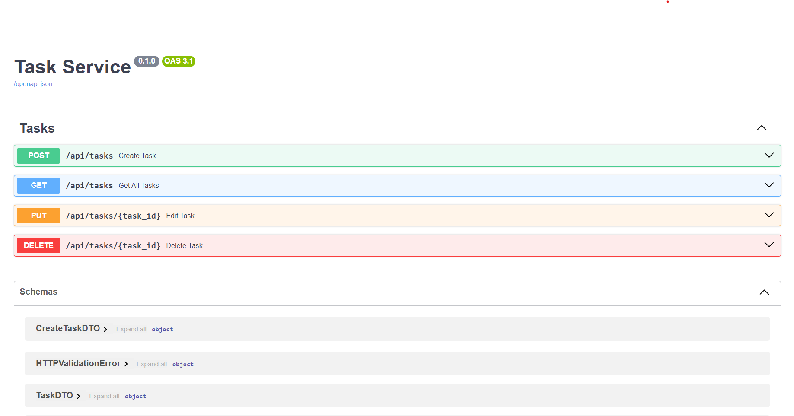

# Test task for "1C-Рарус" company

## Start

- Create .env file in root directory and fill it as in the .env.example

```
# <===== APP =====>
CORS_ALLOWED_ORIGINS=http://127.0.0.1:3000 http://localhost:3000
DEBUG=1

# <===== DATABASE =====>
DB_NAME=DB.db
```

## Install dependencies

`pip install -r requirements.txt`

## Run the application

`uvicorn src.main:app`

### Go to http://localhost:8000/docs


